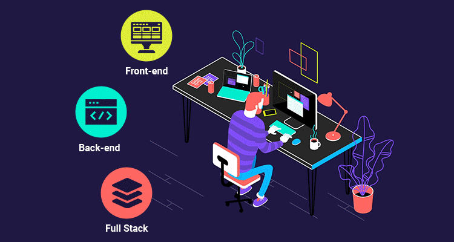
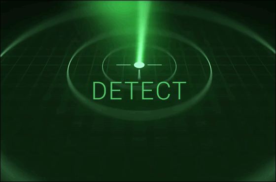

 

<h3>Sobre mim </h3>
🧑🏽‍🎓Olá seja bem vindo. Sou Bruno Dutra, estudante de Cibersegurança e Desenvolvedor de Web Full Stack💻.
 Gosto de todo o processo de desenvolvimento e sempre curioso pra saber o que tem debaixo do capô.

- 🤔 &nbsp; Explorando novas tecnologias e desenvolvendo soluções de software.

- 🎓 &nbsp; Estudando  **Dev Full-Stack** na <a href="https://blueedtech.com.br/">Blue EdTech</a>.

- 🎓 &nbsp; Fazendo graduação na área de **Segurança da Informação - Defesa Cibernética** na <a href="https://estacio.br/cursos/graduacao/defesa-cibernetica">Faculdade Estácio</a>.

## 💼 Technical Skills Dev Full-Stack

 

 

>Estas são algumas das principais tecnologias que utilizo neste momento e para estudos:

**Linguagens & Ferramentas**

 

 

### CIBERSECURITY

 

 

## 🌱 Still studying

 

 

# Let's Connect 

 

 

>Este repositório é voltado para fins de estudos e trabalhos futuros.
